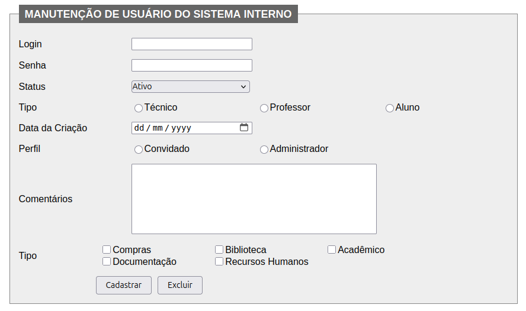

# 🛠️ Manutenção de Usuário do Sistema Interno

Este projeto consiste em um formulário de gerenciamento de usuários para um sistema interno. 
Ele permite o cadastro, edição e exclusão de usuários com diferentes perfis e departamentos.
Projeto desenvolvido para fins educacionais.

---
 

 

## 📋 Funcionalidades
- Cadastro de novos usuários
- Definição de login e senha
- Seleção de status (Ativo/Inativo)
- Escolha de função: Técnico, Professor ou Aluno
- Definição de perfil: Administrador ou Convidado
- Registro da data de criação
- Comentários adicionais
- Associação a departamentos: Compras, Biblioteca, Acadêmico, Documentação, Recursos Humanos
- Botões para **Cadastrar** e **Excluir** usuários

 

## 🧩 Campos do Formulário
| Campo            | Tipo de Entrada       | Descrição                                          |
|------------------|-----------------------|------------------------------------------------    |
| Login            | Texto                 | Nome de usuário para acesso ao sistema             |
| Senha            | Texto (oculto)        | Senha de acesso                                    |
| Status           | Dropdown              | Define se o usuário está ativo ou inativo          |
| Função           | Radio Button          | Define o papel do usuário no sistema               |
| Perfil           | Radio Button          | Define o nível de acesso (Administrador/Convidado) |
| Data da Criação  | Data                  | Data de registro do usuário                        |
| Comentários      | Área de texto         | Informações adicionais sobre o usuário             |
| Departamentos    | Checkbox              | Departamentos aos quais o usuário está vinculado   |
| Ações            | Botões                | Cadastrar ou Excluir usuário                       |

 

## 🧑‍💻 Tecnologias utilizadas
Este formulário foi implementado com:
- HTML5 para estrutura
- CSS3 para estilização

